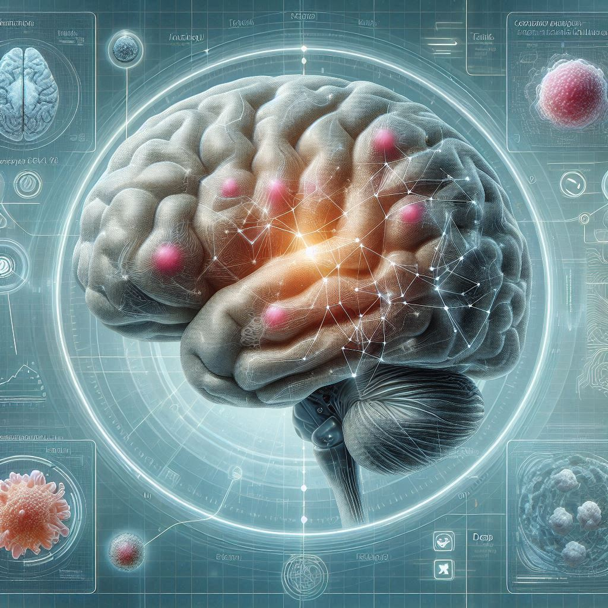

# 🧠 Brain Tumor Detection | AI System

<p align="center">
  
</p>

<p align="center">
  <b>AI-powered MRI Brain Tumor Classification using Deep Learning</b><br>
  Built with TensorFlow • Flask • Modern Web UI
</p>

---

<p align="center">
  
  
  
  
  
</p>

---

# 🚀 Overview

This project is a **Deep Learning-based medical imaging system** that detects and classifies brain tumors from MRI scans.

It provides a **real-time web interface** where users can upload MRI images and receive:

- ✅ Tumor detection result  
- ✅ Tumor classification  
- ✅ Confidence score  

> ⚡ Designed to simulate real-world AI-assisted diagnostic systems.

---

# 🔥 Demo Preview


## 🖥️ UI Interface
![Web Screenshot]


## 📊 Prediction Result
![Result Screenshot]


---

# 🧠 What Makes This Project Strong

✔ End-to-End AI System (Model + Backend + Frontend)  
✔ Real-world Healthcare Use Case  
✔ Clean UI with AI Scan Animation  
✔ Production-style Flask Deployment  
✔ Resume + Portfolio Ready  

---

# 🧪 Tech Stack

## 👨‍💻 Core
- Python
- Flask

## 🤖 AI / ML
- TensorFlow
- Keras
- NumPy

## 🌐 Frontend
- HTML
- CSS (Glassmorphism UI)
- JavaScript

## 🖼 Image Processing
- Pillow

---

# ⚙️ System Workflow

1. User uploads MRI image  
2. Image is preprocessed (128×128, normalized)  
3. Deep Learning model predicts class  
4. Highest probability selected  
5. Result displayed with confidence  

---

# 🧠 Tumor Classes

| Class | Description |
|------|------------|
| Glioma | Tumor in glial cells |
| Meningioma | Tumor in brain membranes |
| Pituitary | Tumor in pituitary gland |
| No Tumor | Healthy brain |

---

# 📂 Project Structure

```

Brain-Tumor-Detection/
│
├── models/
│   └── model.h5
│
├── static/
│   └── BT.jpg
│
├── templates/
│   └── index.html
│
├── main.py
├── requirements.txt
└── README.md

````

---

# 🚀 Installation

## 1️⃣ Clone Repository

```bash
git clone https://github.com/yourusername/brain-tumor-detection.git
cd brain-tumor-detection
````

---

## 2️⃣ Install Dependencies

```bash
pip install -r requirements.txt
```

---

## 3️⃣ Run Application

```bash
python main.py
```

---

## 4️⃣ Open in Browser

```
http://127.0.0.1:5000
```

---

# 📊 Example Output

```
Prediction: Tumor - Meningioma
Confidence: 94.7%
```

```
Prediction: No Tumor
Confidence: 98.3%
```

---

# ⚠️ Disclaimer

This project is strictly for:

* Educational use
* Research purposes

🚫 Not a replacement for medical diagnosis.

---

# 🔮 Future Enhancements

* Grad-CAM Visualization (Explainable AI)
* Model Optimization (ResNet / EfficientNet)
* Cloud Deployment (AWS / Azure)
* Mobile App Integration
* Real Hospital Dataset Integration

---

# 📈 Suggested Improvements (Important)

If you want recruiters to take this seriously:

👉 Add these immediately:

* Real screenshots (NOT placeholders)
* Model accuracy / loss graph
* Dataset reference (Kaggle / medical dataset)
* Live demo (Render / Railway / AWS)

---

# 👨‍💻 Author

**Sumit Kumar**
AI Developer | Machine Learning Enthusiast

---

# ⭐ Support

If you found this useful:

* ⭐ Star this repo
* 🍴 Fork it
* 📢 Share it

---

# 📜 License

MIT License
